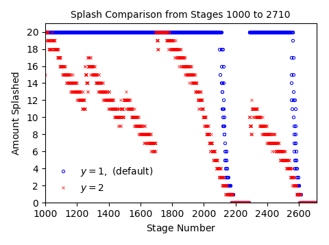
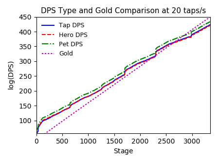

# TT2-Sim: A Gameplay Simulator

TT2-Sim is a analysis focused Tap Titans 2 simulator written in Python.  The design goal of this simulator was to answer several of the many infamous subreddit questions, such as:
- Is it worth buying this thing?
- Can I push to this stage?
- How should I pick my skill-tree?
- How high could I push if there wasn't a stage cap?

From using testing this tool out with others in the subreddit community, we've noticed that the answers to these questions are generally: maybe, yes, it doesn't matter, and the top simulated prediction we've recorded so far is 4895 (calculations above stage 3500 are just an extrapolation of the current model, and will need to be updated when the in-game stage cap is increased).  By entering your current configuration into the PlayerInput.csv file, you can use the simulation to test the impact obtained by changing weapon, pet, and skill-tree configurations yourself.  Moreover, this simulation works well in conjunction with well-known optimizers such as [YATTWO](https://yattwo.me/), as you will now be able to directly observe how your gameplay will change for each suggested optimization.

# Running TT2-Sim
This code was designed to run using Python v3.6+ (see comments in Classes.py for v2.7 compatibility).  In order to use TT2-Sim, you will need to download the repository to a local directory.  The easiest way to set this up with all necessary dependencies is to install the [Anaconda](https://www.continuum.io/downloads) distribution; the installation footprint is quite large compared to what's required to run the sim, but this is the easiest way to get everything working without having to manually install dependencies.  I also recommend running the code through [Sublime Text](https://www.sublimetext.com/); this will allow you to easily run the simulation directly through the text editor (press ctrl+b), instead of having to run everything through the command line.  Initiate the simulation by running the Main.py file.  The Classes.py file is a dependency needed to initialize game data, but can also be run directly to print out a full list of all input variables used in the sim.

# How It Works
The simulation was designed as a a basic version of the TT2 game engine.  While several simplifications are made, the results provide an extremely accurate picture of your game performance in the MS800+ stage range (some of the approximations made may throw off accuracy during the earliest stages, and my ability to test these stages has been limited so far).  The code itself is well-commented, so read through the Main.py file for more details on the processes used.

# Sample Plots and Analysis

<div style="width:1000px;margin-left:150px">

</div>

There is great potential for model analysis using TT2-Sim. A full overview of various of results obtained and studies performed using the sim will be posted on the repository's [Wiki](https://metxchris.github.io/TT2-Sim/).

# Sample Text Output

```
    GENERAL RESULTS:
        Final Stage:  3775      Boss HP:   1.81co
        Start Stage:  1000      Damage:    1.32co
        Hero Levels: [4000 4000 4000 4000 4000 4000 4000 4000] 
                     [4000 4000 4000 4000 4000 4000 4000 4000] 
                     [4000 4000 4000 4000 4000 4000 4000 4000] 
                     [4000 4000 4000 4000 4000 4000 4000 3640] 
                     [3300 2880 2380 2380 2380] Total: 140960

    DAMAGE RESULTS:
        Total DPS:    3.99cn        All Bonus:    651.39aa%
        Hero DPS:     7.43cl        Hero Bonus:      7.44B%
        Melee DPS:    7.43cl        Melee Bonus:   908.63M%
        Ranged DPS: 944.45cj        Ranged Bonus:   86.50k%
        Spell DPS:  493.36cj        Spell Bonus:    60.22k%
        Pet DMG:      3.99cn        Pet Bonus:      63.99M%
        Tap DMG:    118.93ck        Tap Bonus:      87.73k%
        Ship DMG:    74.33cl        Clan Bonus:      3.04T%
        Crit Max:     179.09        Artifact:      348.61k%
        Crit Min:      26.86        Crit Chance:     50.00%

    GOLD RESULTS:
        Total Earned:    2.21cr     Multiplier:    8.81k
        Boss Gold:       2.21cr     Multiplier:   200.80
        Chest Gold:      8.56cq     Multiplier:    24.42
        Titan Gold:    483.14cp     Multiplier:    46.50
        10x Chance:      22.00%     Multiplier:     2.98  *
        TF Chance:        1.00%     Multiplier:     1.02  **
        Remaining:     452.18cq     Spent:        1.76cr

        *  No bonus with HoM.
        ** No bonus with HoM or Bosses.

    SPLASH RESULTS (PET ATTACKS):
        Maximum Splash Stage:       x20: 3597   x4: 3630 
                                    x3:  3633   x2: 3636
        Continuous Splash Stage:    x20: 3499   x4: 3530 
                                    x3:  3533   x2: 3536
        Splash Factor: 0.0504

    HERO EVOLVE STAGES:
        1st Evolve:  [1000 1000 1000 1000 1000 1000 1000 1000] 
                     [1000 1000 1000 1000 1000 1000 1000 1000] 
                     [1000 1000 1000 1000 1000 1000 1000 1001] 
                     [1001 1005 1126 1283 1457 1661 1895 2120] 
                     [2337 2611 2925 2925 2925]
        2nd Evolve:  [1001 1002 1009 1020 1036 1051 1075 1090] 
                     [1109 1126 1140 1159 1178 1203 1216 1238] 
                     [1259 1289 1316 1348 1372 1406 1449 1498] 
                     [1555 1643 1766 1921 2096 2305 2534 2760] 
                     [2975 3249 3564 3564 3564]

    ATTACKS AND TIMES TO REACH STAGE: 3775
        ---------------------------------------------
        Attack Interval      Attacks    Time Required
        ---------------------------------------------
                0.1 sec       65.77k      162.04 mins 
                0.2 sec       37.25k      175.92 mins 
                0.3 sec       27.75k      157.27 mins *
                0.4 sec       22.99k      171.74 mins 
                0.5 sec       20.18k      186.69 mins 
                0.6 sec       18.18k      200.33 mins 
                0.8 sec       15.82k      229.41 mins 
                1.0 sec       14.44k      259.25 mins 
                1.5 sec       12.46k      329.90 mins 
                2.0 sec       11.54k      403.27 mins 
                3.0 sec       10.53k      545.00 mins 
        ---------------------------------------------
        Heav. Strikes:       317.74k       20.24 days
        Pet Attacks:          14.44k      259.25 mins
        Transitions:             555       18.50 mins
        ---------------------------------------------
        * Monster Death Animation Delay: 0.3 sec
```

# Credit
Special thanks to Marxz13 for collaborating with me on various gameplay aspects, testing for accuracy issues, and being a great community resource.  Also thanks to [Colblitz](https://github.com/colblitz) for helping me find several gameplay formulas I was missing.  Additionally, thanks to Byungshin for helping me nail down a few errors in the gold calculations.