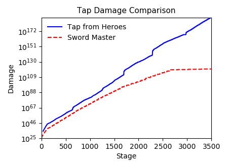

# TT2-Sim: A Gameplay Simulator

*Update notes listed [here](https://github.com/metxchris/TT2-Sim/tree/master/docs#update-history).*

*See how to calibrate the time-table for your device [here](https://github.com/metxchris/TT2-Sim/blob/master/docs/calibration.md#device-calibration).*

TT2-Sim is an analysis focused Tap Titans 2 simulator written in Python.  The design goal of this simulator was to answer several of the many infamous subreddit questions, such as:
- Is it worth buying this thing?
- Can I push to this stage?
- How should I pick my skill-tree?
- How high could I push if there wasn't a stage cap?

From using testing this tool out with others in the subreddit community, we've noticed that the answers to these questions are generally: maybe, yes, it doesn't matter, and the top simulated prediction we've recorded so far is 4895 (calculations above stage 3500 are just an extrapolation of the current model, and will need to be updated when the in-game stage cap is increased).  By entering your current configuration into the PlayerInput.csv file, you can use the simulation to test the impact obtained by changing weapon, pet, and skill-tree configurations yourself.  Moreover, this simulation works well in conjunction with well-known optimizers such as [YATTWO](https://yattwo.me/), as you will now be able to directly observe how your gameplay will change for each suggested optimization.

# Running TT2-Sim
This code was designed to run using Python v3.6+ (see comments in Classes.py for v2.7 compatibility).  In order to use TT2-Sim, you will need to download the repository to a local directory.  The easiest way to set this up with all necessary dependencies is to install the [Anaconda](https://www.continuum.io/downloads) distribution; the installation footprint is quite large compared to what's required to run the sim, but this is the easiest way to get everything working without having to manually install dependencies.  I also recommend running the code through [Sublime Text](https://www.sublimetext.com/); this will allow you to easily run the simulation directly through the text editor (press ctrl+b), instead of having to run everything through the command line.  Initiate the simulation by running the TT2-Simulation.py file.  The DataClasses.py file is a dependency needed to initialize game data, but can also be run directly to print out a full list of all input variables used in the sim.

# How It Works
The simulation was designed as a a basic version of the TT2 game engine.  While several simplifications are made, the results provide an extremely accurate picture of your game performance in the MS800+ stage range (some of the approximations made may throw off accuracy during the earliest stages, and my ability to test these stages has been limited so far).  The code itself is well-commented, so read through the TT2-Simulation.py file for more details on the processes used.

# Sample Plots

<div style="width:1000px;margin-left:150px">

<div style="width:1000px;margin-left:150px">

<div style="width:1000px;margin-left:150px">

</div>

# Sample Text Output

```
    GENERAL RESULTS FOR: MetxChris
    ―――――――――――――――――――――――――――――――――――――――――
    Final Stage: 4020       Boss HP:  18.28cs
    Start Stage: 1250       Damage:   11.21cs
    ――――――――――――――――――――――――――――――――――――――――――――――――――――――
    Hero Levels: [6000 6000 6000 6000 6000 6000 6000 6000] 
                 [6000 6000 6000 6000 6000 6000 6000 6000] 
                 [6000 6000 6000 6000 6000 6000 6000 6000] 
                 [5940 5800 5610 5360 5090 4760 4410 4050] 
                 [3710 3290 2790 2790 2790] Total: 200390


    ACTIVE SKILL INFO:
    ―――――――――――――――――――――――――――――――――――――
    Name              Level       Effect 
    ―――――――――――――――――――――――――――――――――――――
    Crit Strike          15        50.00%
    Hand of Midas        15         13.80
    War Cry              15         1.40k
    ―――――――――――――――――――――――――――――――――――――


    DAMAGE RESULTS:
    ―――――――――――――――――――――――――――――――――――――――
    Type            Amount        Bonus    
    ―――――――――――――――――――――――――――――――――――――――
    Total DPS        373.79cr     415.75ab%
    Hero DPS         109.83cp      196.40B%
    Melee DPS        109.80cp        2.49B%
    Ranged DPS        24.77co      561.11k%
    Spell DPS:         5.82co      131.83k%
    Pet DMG:         280.34cr      276.79M%
    Tap DMG:           1.76cp        1.46M%
    Clan DMG:          1.10cq       17.58T%
    ―――――――――――――――――――――――――――――――――――――――
    Crit Chance:                     50.00%
    Crit Max:          196.99
    Crit Min:           29.55
    ―――――――――――――――――――――――――――――――――――――――
    Artifact DMG:                   494.76k%


    GOLD RESULTS:
    ―――――――――――――――――――――――――――――――――――――――
    Type             Amount      Multiplier
    ―――――――――――――――――――――――――――――――――――――――
    Total Earned     238.07cv        93.48k
    Boss Gold        236.36cv        200.80
    Chest Gold         1.64cv         44.77
    Titan Gold        75.68cu         69.75
    TF Chance           1.00%          1.02 †
    10x Chance         22.00%          2.98 ‡
    ―――――――――――――――――――――――――――――――――――――――
    Remaining         47.87cv
    Spent            190.20cv
    ―――――――――――――――――――――――――――――――――――――――
    † Does not multiply with HoM or Bosses.
    ‡ Does not multiply with HoM.


    SPLASH RESULTS BY STAGE (PET ATTACKS):
    ――――――――――――――――――――――――――――――――――――――――――――――――――――
    Splash Amount    Splash Maximum         Splash Floor
    ――――――――――――――――――――――――――――――――――――――――――――――――――――
              x20              3906                 3887
               x4              3936                 3918
               x3              3938                 3920
               x2              3940                 3922
               x1              3962                 3925
    ――――――――――――――――――――――――――――――――――――――――――――――――――――
    Splash Factor: 0.0705


    HERO EVOLVE STAGES:
    ――――――――――――――――――――――――――――――――――――――――――――――――――――――
    1st Evolve:  [1250 1250 1250 1250 1250 1250 1250 1250] 
                 [1250 1250 1250 1250 1250 1250 1250 1250] 
                 [1250 1250 1250 1250 1250 1250 1250 1250] 
                 [1250 1250 1250 1265 1439 1647 1875 2101] 
                 [2318 2591 2905 2905 2905]
    2nd Evolve:  [1250 1250 1250 1250 1250 1250 1250 1250] 
                 [1250 1250 1250 1251 1251 1251 1251 1251] 
                 [1252 1271 1296 1329 1353 1387 1430 1479] 
                 [1536 1624 1746 1901 2076 2286 2515 2740] 
                 [2956 3226 3545 3545 3545]


    ATTACKS AND TIMES TO REACH STAGE: 4020
    ―――――――――――――――――――――――――――――――――――――――――――――――――――――――――――――――――――――――――――――
    Attack Interval    Attacks      Active Time      Wasted Time       Total Time
    ―――――――――――――――――――――――――――――――――――――――――――――――――――――――――――――――――――――――――――――
            0.1 sec     12.77k       14.36 mins        1.82 hrs         2.06 hrs 
            0.2 sec      9.76k       15.68 mins        1.81 hrs         2.07 hrs 
            0.3 sec      8.79k       27.21 mins        1.80 hrs         2.25 hrs 
            0.4 sec      8.27k       14.74 mins        1.79 hrs         2.04 hrs 
            0.5 sec      8.00k       38.20 mins        1.79 hrs         2.42 hrs 
            0.6 sec      7.78k        1.02 hrs         1.78 hrs         2.80 hrs 
            0.7 sec      7.65k        1.18 hrs         1.78 hrs         2.96 hrs 
            0.8 sec      7.53k       13.45 mins        1.78 hrs         2.00 hrs 
            0.9 sec      7.45k       24.94 mins        1.77 hrs         2.19 hrs 
            1.0 sec      7.38k       36.35 mins        1.77 hrs         2.38 hrs 
            1.5 sec      7.18k        1.56 hrs         1.76 hrs         3.32 hrs 
            2.0 sec      7.06k        2.50 hrs         1.75 hrs         4.25 hrs 
            3.0 sec      6.95k        4.38 hrs         1.74 hrs         6.12 hrs 
    ―――――――――――――――――――――――――――――――――――――――――――――――――――――――――――――――――――――――――――――
    Tap Attacks          2.20B        3.49 yrs         2.21 hrs         3.50 yrs 
    Heav. Strikes      131.81k        6.04 days        1.90 hrs         6.12 days
    Pet Attacks          7.58k        7.74 mins        1.78 hrs         1.91 hrs 
    ―――――――――――――――――――――――――――――――――――――――――――――――――――――――――――――――――――――――――――――
    KillAnimationTime + DeviceLag + MeasurementLag: 0.75 sec
```

# Credit
Special thanks to Marxz13 for collaborating with me on various gameplay aspects, testing for accuracy issues, and being a great community resource.  Also thanks to [Colblitz](https://github.com/colblitz) for helping me find several gameplay formulas I was missing.  Additionally, thanks to Byungshin for helping me nail down a few errors in the gold calculations.